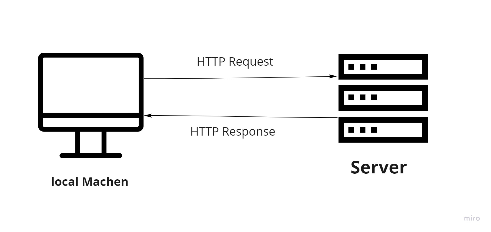

# Moves website - v 1.0.0

**Author Name**: Yazan sufian

## WRRC

## Overview

web site to show movies and its detalis

## Getting Started

1- Create server.js file

2- npm init -y

3- npm install express

4- const express = require("express")

5- const app = express()

6- app.listen(PORT, ()=>{ console.log("Anything") })

## Project Features

add main page shoing move details and another page for favorute