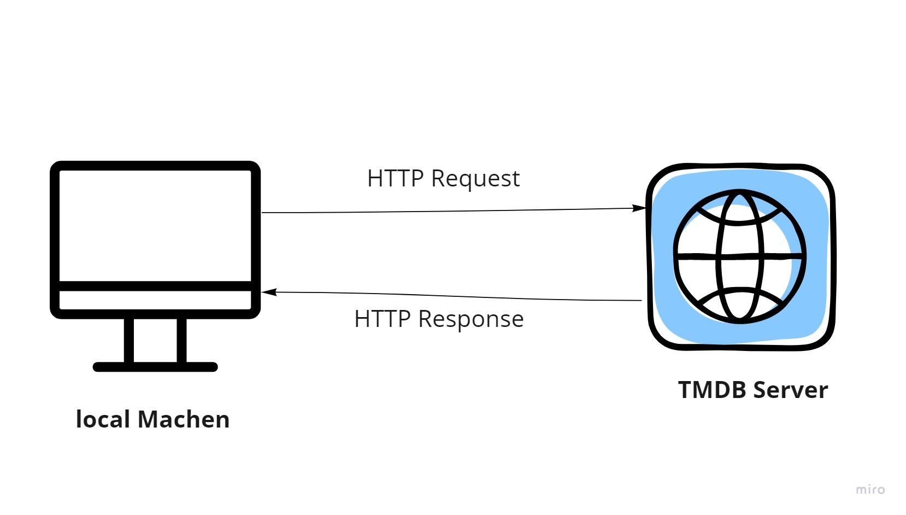

# Moves website - v 1.0.0

**Author Name**: Yazan sufian

## WRRC

## Overview

web site to show movies and its detalis

## Getting Started

 ### 20/2/2022 updates

1- Create server.js file

2- npm init -y

3- npm install express

4- const express = require("express")

5- const app = express()

6- app.listen(PORT, ()=>{ console.log("Anything") })
 
 ### 21/2/2022 updates

1- install axios

2-create .env file to save api key inside it.

3- take API from TMDB wepsite and clone it .

4- create new tow endpoints (trending , search)

### 22/2/2022 updates

1- install PostgerSQL

2-Run PostgerSQL 

3- Creating table using pg 

4- retrive data from table 

### 23/2/2022 updates

**Create request to the database for the following endpoints:**
 
> /updatMovie/:id: create an **update** request to *specific* movie in the database.

> /deleteMovie/:id: create a delete request to remove a specific movie from database.

> /getMovie/id: Create a get request to get a *specific* movie from the database

## Project Features

add main page shoing move details and another page for favorute

### 24/2/2022 updates

finish working in the movie app and deployed a link of the  server

what I’ve learned so far?

- API
- JS SERVER
- HEROKU
